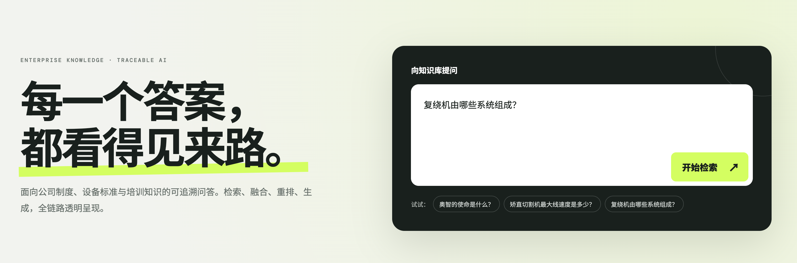
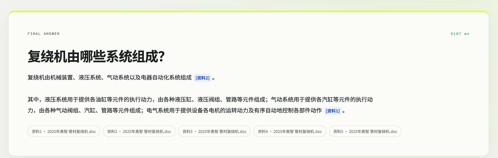
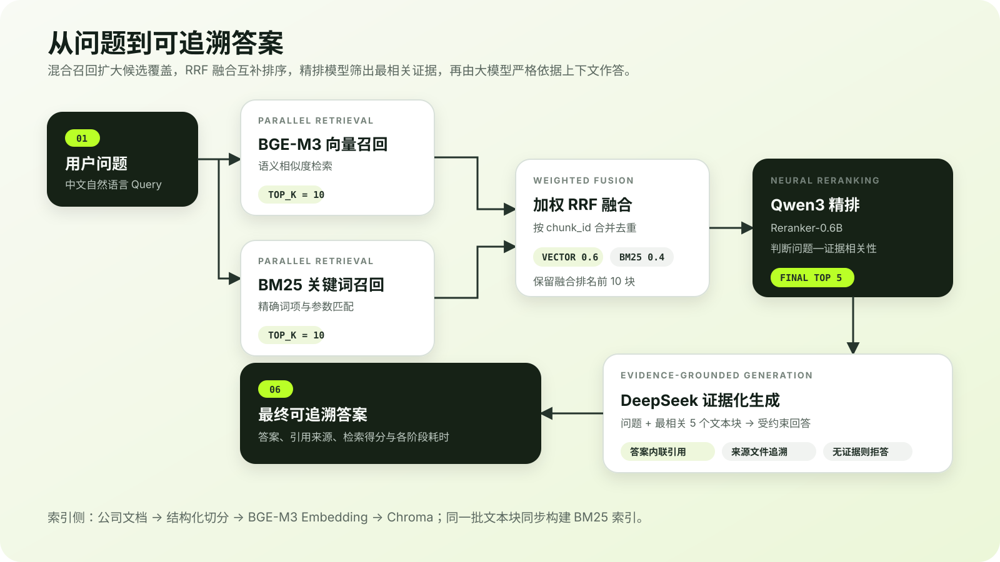

# 企业 RAG 知识库问答

一个面向中文企业文档的本地 RAG 知识库。系统采用 **BGE-M3 向量召回 + BM25 关键词召回 + 加权 RRF 融合 + Qwen3 精排 + DeepSeek 证据化生成**，并在前端完整展示每一步检索结果、得分、来源及耗时。

> 企业原始文档、评测数据、模型权重、向量索引和 API Key 均未提交到本仓库。

## 项目展示

### 提问页面



### 答案与来源引用



## RAG 完整流程



核心检索参数：

- BGE-M3 向量召回 `top_k=10`；
- BM25 关键词召回 `top_k=10`；
- 按 `chunk_id` 合并去重，使用加权 RRF 融合：向量权重 `0.6`、BM25 权重 `0.4`；
- 取融合排名前 10 个文本块交给 `Qwen/Qwen3-Reranker-0.6B` 精排；
- 选择精排前 5 个文本块，交给 `deepseek-v4-flash` 生成带来源引用的答案。

## 功能特点

- **混合检索**：语义检索和关键词检索互补，兼顾自然语言问法、专业术语与精确参数。
- **两阶段排序**：加权 RRF 负责稳定融合，Qwen3 Reranker 进一步判断问题与文本块的直接相关性。
- **证据化回答**：模型只依据最终上下文回答，答案内显示引用编号，并可追溯到来源文件和文本块。
- **全链路可视化**：前端可查看向量 Top 10、BM25 Top 10、RRF 融合、精排结果、最终上下文及阶段耗时。
- **本地轻量部署**：Embedding、Reranker、Chroma 和 BM25 均在本机运行，仅最终答案生成调用 DeepSeek API。
- **可测试**：包含检索融合、文档切分、API 和评测结果解析测试。

## 技术栈

| 模块 | 技术 |
| --- | --- |
| 前端 | Vite、React |
| 后端 | FastAPI、Python 3.12、uv |
| 向量模型 | BAAI/bge-m3 |
| 关键词检索 | BM25、Jieba |
| 向量数据库 | Chroma PersistentClient |
| 融合算法 | Weighted Reciprocal Rank Fusion |
| 重排序模型 | Qwen/Qwen3-Reranker-0.6B |
| 生成模型 | deepseek-v4-flash |

## 项目结构

```text
.
├── backend/              # FastAPI 接口与应用服务
├── frontend/             # Vite + React 前端
├── rag/                  # Prompt 与 DeepSeek 生成链路
├── retrieval/            # Chroma、BM25、RRF 和 Reranker
├── tests/                # 单元测试与 API 测试
├── docs/images/          # README 展示图片
├── main.py               # 文档解析入口
└── pyproject.toml        # Python 项目依赖
```

## 快速启动

### 1. 准备环境

安装 Python 3.12、[uv](https://docs.astral.sh/uv/) 和 Node.js，然后克隆项目：

```bash
git clone https://github.com/zhaoyijia-web/rag-knowledge-base.git
cd rag-knowledge-base
uv sync

cd frontend
npm install
cd ..
```

### 2. 准备配置和本地模型

复制环境变量模板：

```bash
cp .env.example .env
```

在 `.env` 中填写：

```dotenv
DEEPSEEK_API_KEY=填写自己的Key
DEEPSEEK_BASE_URL=https://api.deepseek.com
DEEPSEEK_MODEL=deepseek-v4-flash

EMBEDDING_MODEL_PATH=/本机模型目录/bge-m3
RERANKER_MODEL_PATH=/本机模型目录/Qwen3-Reranker-0.6B
```

本地模型可通过 ModelScope 下载：

```bash
uv run modelscope download --model BAAI/bge-m3 --local_dir /本机模型目录/bge-m3
uv run modelscope download --model Qwen/Qwen3-Reranker-0.6B --local_dir /本机模型目录/Qwen3-Reranker-0.6B
```

将企业文档处理为 `data/processed/chunks.jsonl` 后即可构建索引。出于企业资料保护考虑，本仓库不公开原始文档、文档解析程序、切块结果和已生成索引。

### 3. 构建索引

```bash
uv run python -m retrieval.build_index
```

### 4. 启动后端

```bash
uv run uvicorn backend.app:app --host 127.0.0.1 --port 8000
```

后端启动后可访问：

- API 文档：<http://127.0.0.1:8000/docs>
- 健康检查：<http://127.0.0.1:8000/api/health>

### 5. 启动前端

打开另一个终端：

```bash
cd frontend
npm run dev -- --host 127.0.0.1
```

浏览器访问：<http://127.0.0.1:5173>

> 后端启动时会一次性加载 BGE-M3、Qwen3 Reranker、Chroma 和 BM25。开发阶段不建议开启多个 worker，否则每个 worker 都会重复占用内存。

## API 示例

```bash
curl -X POST http://127.0.0.1:8000/api/ask \
  -H 'Content-Type: application/json' \
  -d '{"question":"公司的使命是什么？"}'
```

接口返回生成答案、5 个来源文本块，以及向量检索、BM25、融合、精排和生成耗时。

## 测试

```bash
uv run python -m unittest discover -s tests -v

cd frontend
npm run build
```

## 评测结果

项目使用 88 道有效问题进行端到端测试，并记录 Context Relevance、Faithfulness 与 Answer Relevance 三项指标：

| 指标 | 平均分 | 满分率 |
| --- | ---: | ---: |
| Context Relevance | 0.9574 | 90.91% |
| Faithfulness | 1.0000 | 100.00% |
| Answer Relevance | 0.9659 | 92.05% |

评分范围为 `0 / 0.25 / 0.5 / 0.75 / 1`。评测文件包含企业资料内容，因此未公开。

## License

本项目用于个人学习与作品展示。企业文档及其衍生数据不属于开源内容。
