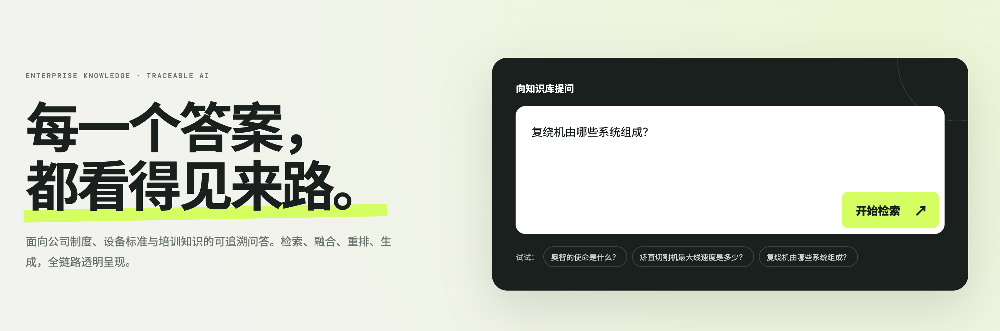
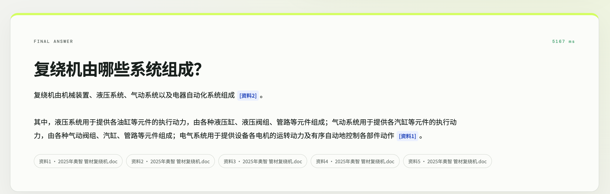
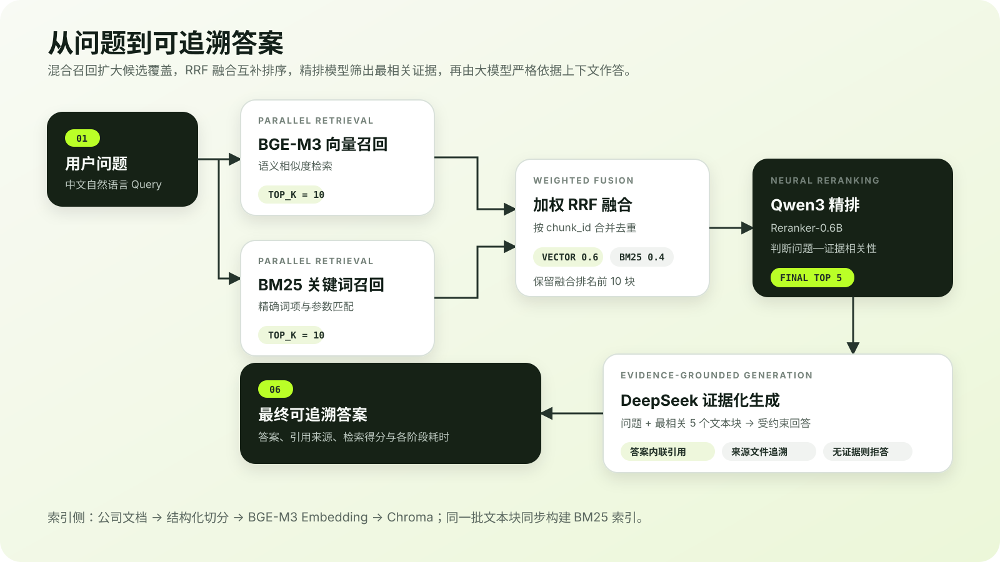

# 企业 RAG 知识库问答

一个面向中文企业文档的本地 RAG 知识库。系统采用 **BGE-M3 向量召回 + BM25 关键词召回 + 加权 RRF 融合 + Qwen3 精排 + DeepSeek 证据化生成**。仓库还提供六文件 LangChain 建库与命令行问答脚本；FastAPI/React 演示读取该脚本生成的同一索引。

> 企业原始文档、评测数据、模型权重、向量索引和 API Key 均未提交到本仓库。

## 项目展示

### 提问页面



### 答案与来源引用



## RAG 完整流程



核心检索参数：

- BGE-M3 向量召回 `top_k=10`；
- BM25 关键词召回 `top_k=10`；
- 按 `chunk_id` 合并去重，使用加权 RRF 融合：向量权重 `0.6`、BM25 权重 `0.4`；
- 取融合排名前 10 个文本块交给 `Qwen/Qwen3-Reranker-0.6B` 精排；
- 选择精排前 5 个文本块，交给 `deepseek-v4-flash` 生成带来源引用的答案。

## 功能特点

- **混合检索**：语义检索和关键词检索互补，兼顾自然语言问法、专业术语与精确参数。
- **两阶段排序**：加权 RRF 负责稳定融合，Qwen3 Reranker 进一步判断问题与文本块的直接相关性。
- **证据化回答**：模型只依据最终上下文回答，答案内显示引用编号，并可追溯到来源文件和文本块。
- **全链路可视化**：前端可查看向量 Top 10、BM25 Top 10、RRF 融合、精排结果、最终上下文及阶段耗时。
- **本地轻量部署**：Embedding、Reranker、Chroma 和 BM25 均在本机运行，仅最终答案生成调用 DeepSeek API。
- **可测试**：包含检索融合、文档切分、API 和评测结果解析测试。

## 技术栈

| 模块 | 技术 |
| --- | --- |
| 前端 | Vite、React |
| 后端 | FastAPI、Python 3.12、uv |
| 向量模型 | BAAI/bge-m3 |
| 关键词检索 | BM25、Jieba |
| 向量数据库 | Chroma PersistentClient |
| 六文件实验编排 | LangChain Document、LangChain Chroma |
| 融合算法 | Weighted Reciprocal Rank Fusion |
| 重排序模型 | Qwen/Qwen3-Reranker-0.6B |
| 生成模型 | deepseek-v4-flash |

## 项目结构

```text
.
├── backend/              # FastAPI 接口与应用服务
├── frontend/             # Vite + React 前端
├── rag/                  # Prompt 与 DeepSeek 生成链路
├── retrieval/            # Chroma、BM25、RRF 和 Reranker
├── langchain_rag_pipeline.py  # 六文件建库与问答命令行脚本
├── tests/                # 单元测试与 API 测试
├── docs/images/          # README 展示图片
└── pyproject.toml        # Python 项目依赖
```

## 快速启动

### 1. 准备环境

安装 Python 3.12、[uv](https://docs.astral.sh/uv/) 和 Node.js，然后克隆项目：

```bash
git clone https://github.com/zhaoyijia-web/rag-knowledge-base.git
cd rag-knowledge-base
uv sync

cd frontend
npm install
cd ..
```

### 2. 准备配置和本地模型

复制环境变量模板：

```bash
cp .env.example .env
```

在 `.env` 中填写：

```dotenv
DEEPSEEK_API_KEY=填写自己的Key
DEEPSEEK_BASE_URL=https://api.deepseek.com
DEEPSEEK_MODEL=deepseek-v4-flash

EMBEDDING_MODEL_PATH=/本机模型目录/bge-m3
RERANKER_MODEL_PATH=/本机模型目录/Qwen3-Reranker-0.6B
```

本地模型可通过 ModelScope 下载：

```bash
uv run modelscope download --model BAAI/bge-m3 --local_dir /本机模型目录/bge-m3
uv run modelscope download --model Qwen/Qwen3-Reranker-0.6B --local_dir /本机模型目录/Qwen3-Reranker-0.6B
```

出于企业资料保护考虑，本仓库不公开原始文档、Word 文档解析程序、切块结果和已生成索引。因此，公开仓库无法只靠 `git clone` 复现下面的六文件建库；需要在本地准备对应的 4 份 Word、2 份 PDF 和私有的 `ingestion/build_chunks.py`。

### 3. 运行六文件 LangChain 实验（命令行）

以下命令均在项目根目录执行。两份 PDF 使用 PyMuPDF 提取原生文字，无 OCR；审核稿只保留两份标准的第 3～6 章，火灾规则另保留附录 A。每个大章节对应一个向量块，并记录 PDF 物理页码范围。Word 仍沿用各自的切块规则。

当前本地已有 `data/experiments/pdf_page_review.json`，先对照原 PDF 核查其中 `chapters[*].segments`，尤其是排放标准表格的行列、数值和单位。**已有审核稿时不要运行 `prepare`**；它会因文件已存在而拒绝覆盖。只有确认全部章节后，才执行：

```bash
uv run python langchain_rag_pipeline.py approve --confirm-reviewed
uv run python langchain_rag_pipeline.py build
uv run python langchain_rag_pipeline.py search "重大火灾隐患如何判定？"
uv run python langchain_rag_pipeline.py ask "重大火灾隐患如何判定？"
```

如果在新环境中**尚无审核稿**，先运行 `uv run python langchain_rag_pipeline.py prepare`，人工核对后再执行上述命令。实验索引已存在且需要重新向量化时，用 `rebuild` 代替 `build`；旧实验索引会被保留为备份：

```bash
uv run python langchain_rag_pipeline.py rebuild
```

新集合名为 `enterprise_rag_pdf_pilot`，保存在 `data/experiments/langchain_pdf_pilot/chroma/`；同目录还会生成 `chunks.jsonl`、`bm25.json` 和 `manifest.json`。精排输入上限为 5120 token，`batch_size=2`；长章节的实际耗时及内存占用需在本机验证。`search` 只检索和精排，`ask` 还会调用 DeepSeek API。

### 4. FastAPI/React 演示（共用六文件索引）

服务读取 `data/experiments/langchain_pdf_pilot/` 下的 Chroma、BM25 和文本块文件；启动前必须已在本地完成上面的六文件建库。旧的 `data/chroma/` 索引不再是运行时数据源。

启动后端：

```bash
uv run uvicorn backend.app:app --host 127.0.0.1 --port 8000
```

后端启动后可访问：

- API 文档：<http://127.0.0.1:8000/docs>
- 健康检查：<http://127.0.0.1:8000/api/health>

启动前端（另一个终端）：

```bash
cd frontend
npm run dev -- --host 127.0.0.1
```

浏览器访问：<http://127.0.0.1:5173>

> 后端启动时会一次性加载 BGE-M3、Qwen3 Reranker、Chroma 和 BM25。开发阶段不建议开启多个 worker，否则每个 worker 都会重复占用内存。

## API 示例

```bash
curl -X POST http://127.0.0.1:8000/api/ask \
  -H 'Content-Type: application/json' \
  -d '{"question":"公司的使命是什么？"}'
```

接口返回生成答案、5 个来源文本块，以及向量检索、BM25、融合、精排和生成耗时。

## 测试

```bash
uv run python -m unittest discover -s tests -v

cd frontend
npm run build
```

## 评测结果

六文件索引在 88 道有效问题上的评测结果如下。检索与生成两阶段平均耗时分别为 **3.75 s** 和 **1.26 s**，合计 **5.02 s/题**；合计值不是 HTTP 端到端耗时。

| Ragas 指标 | 平均分 |
| --- | ---: |
| 忠实度（Faithfulness） | 0.7625 |
| 上下文相关性（Context Relevance） | 0.9574 |
| 答案相关性（Answer Relevancy） | 0.8741 |

另有自定义 LLM 裁判评分，与 Ragas 指标不同，不在此表混用。逐题评测文件包含企业资料内容，因此未公开；其中部分低分题仍需人工复核。

## License

本项目用于个人学习与作品展示。企业文档及其衍生数据不属于开源内容。
